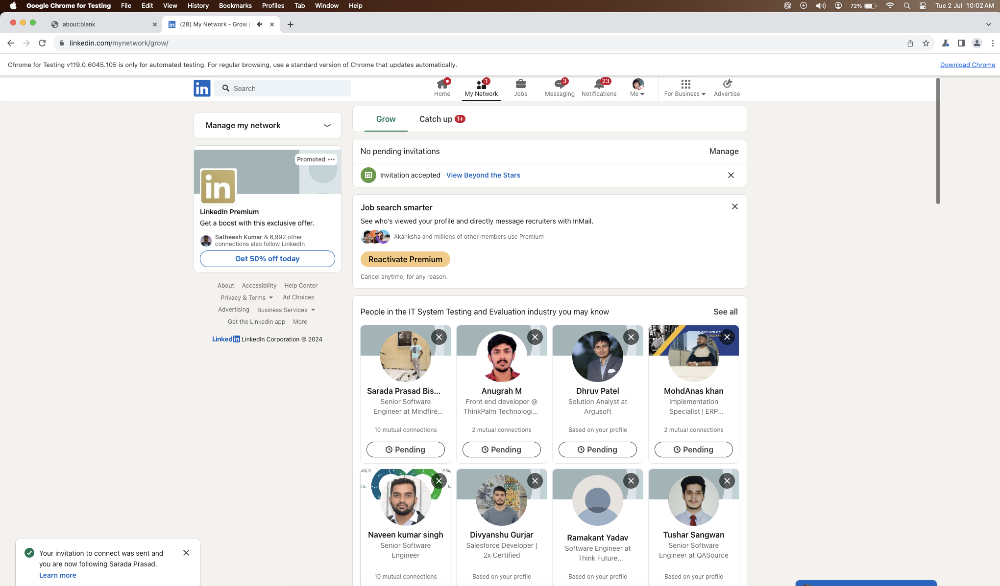
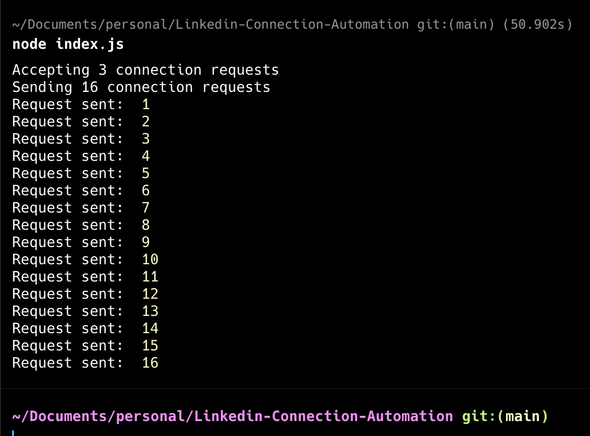

# README for Puppeteer LinkedIn Automation Script





## Description
This script automates various LinkedIn activities using Puppeteer, a Node library which provides a high-level API to control Chrome or Chromium over the DevTools Protocol. It includes functionalities like logging in to LinkedIn, accepting connection requests, and sending out connection invitations.

## Known BUg
- If a Message box appears while sending connection request, the script will not work properly.

## Features
- **Automated Login**: Log in to LinkedIn using your credentials stored in environment variables.
- **Connection Request Management**: Automatically accept incoming connection requests.
- **Connection Request Sending**: Send out connection invitations up to a specified limit.
- **Auto-scrolling**: The script scrolls through the page to load and interact with more elements.

## Prerequisites
- Node.js
- npm (Node package manager)
- Google Chrome or Chromium browser

# Caution - Do not send more then 30 connection request in a day. Linkedin may block your account for 1 week.

## Installation
1. Clone the repository:
   ```sh
   git clone https://github.com/Rex-Arnab/Linkedin-Connection-Automation.git
   ```
2. Navigate to the cloned directory:
   ```sh
   cd Linkedin-Connection-Automation
   ```
3. Install dependencies:
   ```sh
   npm install
   ```

## Setup
1. Rename the `SAMPLE.env` file to `.env`.
2. Update the `.env` file with your LinkedIn credentials and other configurations:
   ```
   USERNAME=your_email@example.com
   PASSWORD=your_password
   NO_OF_CONNECTION_TO_SEND=10
   ```

## Usage
Run the script with Node:
```sh
node index.js
```

## Important Notes
- This script automates actions on your LinkedIn account. Use it responsibly to avoid violating LinkedIn's terms of service.
- The script runs in a non-headless browser for visibility, but it can be adjusted to run headlessly.
- It is advisable to use this script moderately to prevent any potential temporary or permanent restrictions on your LinkedIn account due to unusual activity.

## Contributing
Contributions to enhance this script or add new features are welcome. Please fork the repository and create a pull request with your changes.

## License
Specify your license here.

---

**Disclaimer**: This script is provided for educational purposes only. Any misuse or violation of LinkedIn's terms of service is not encouraged. The author is not responsible for any consequences incurred from the use of this script.